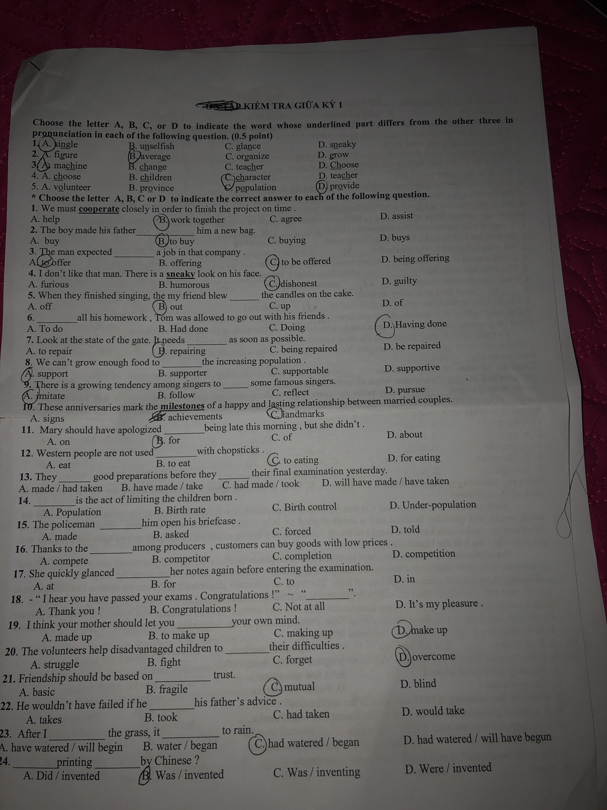
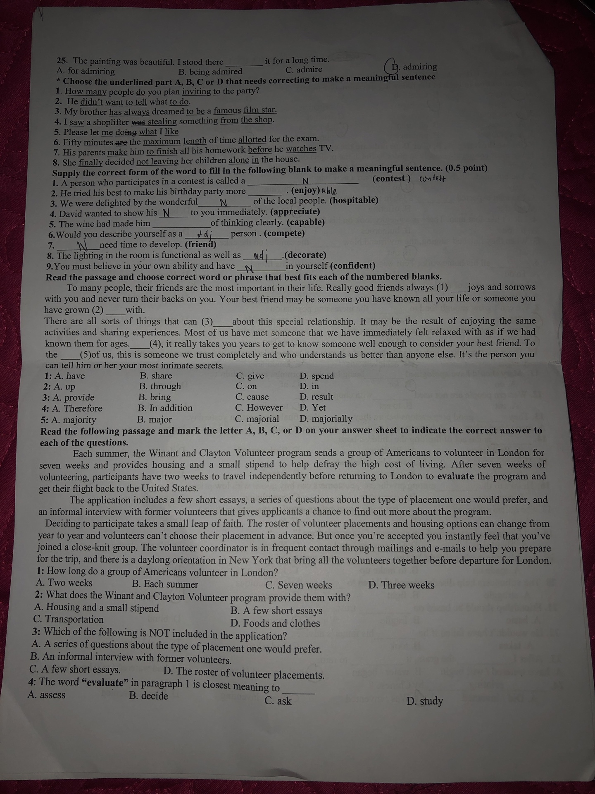
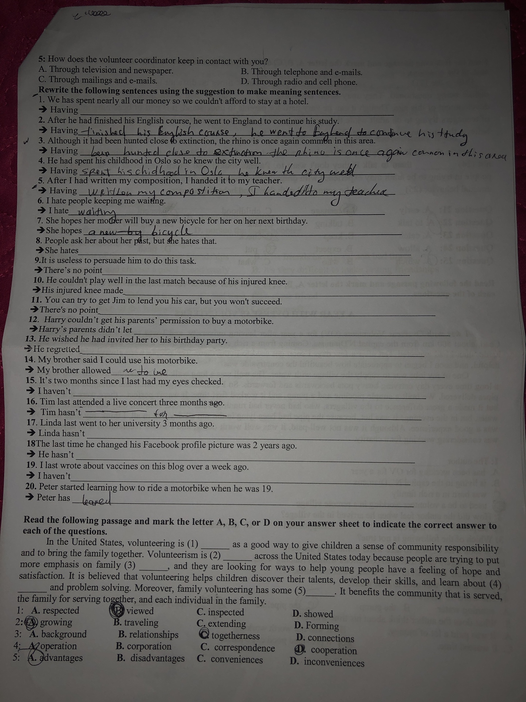
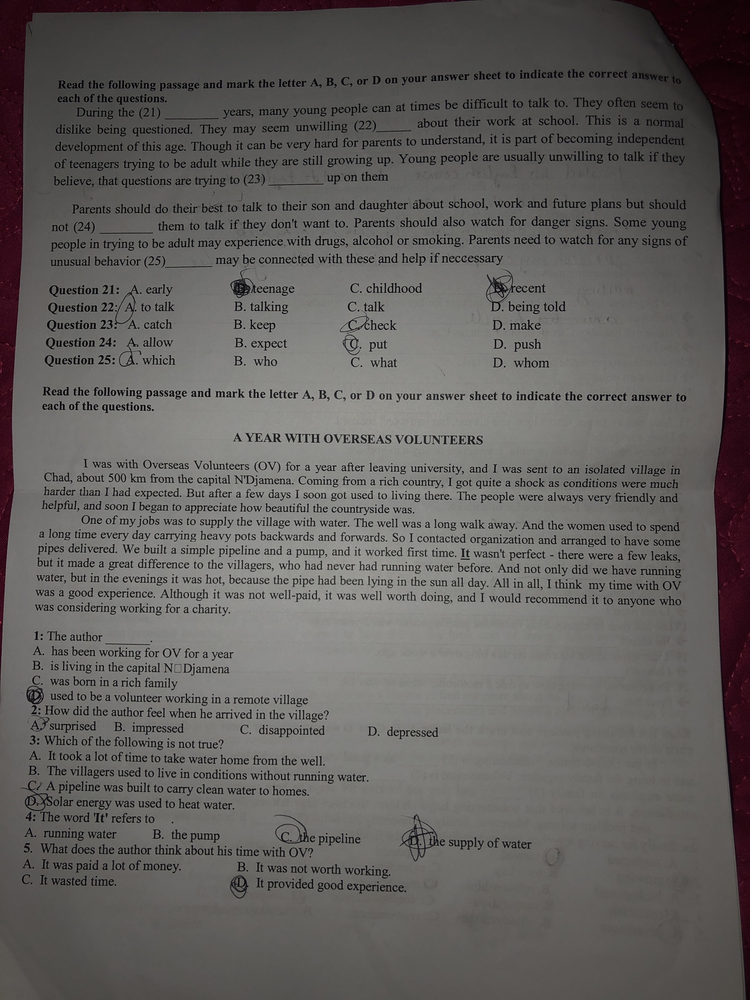
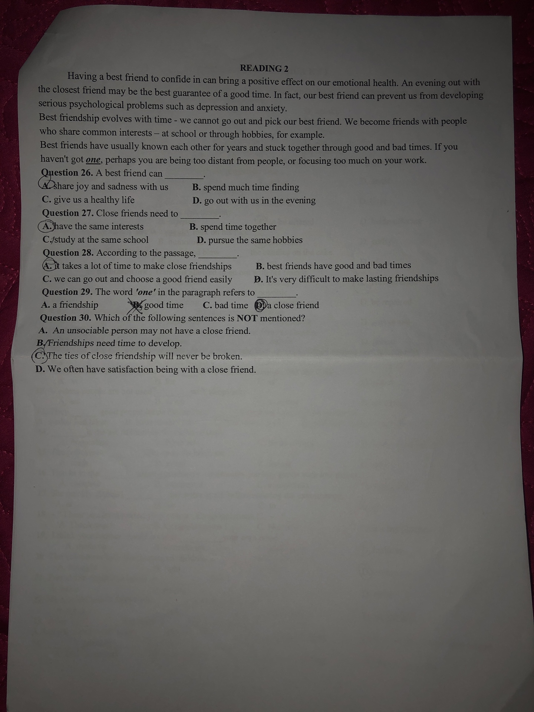
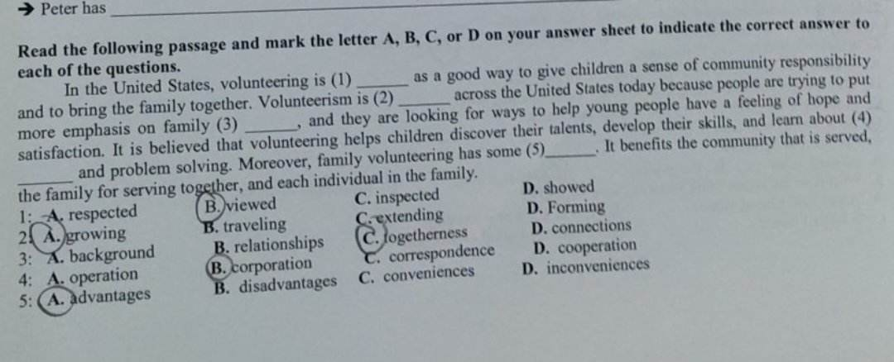
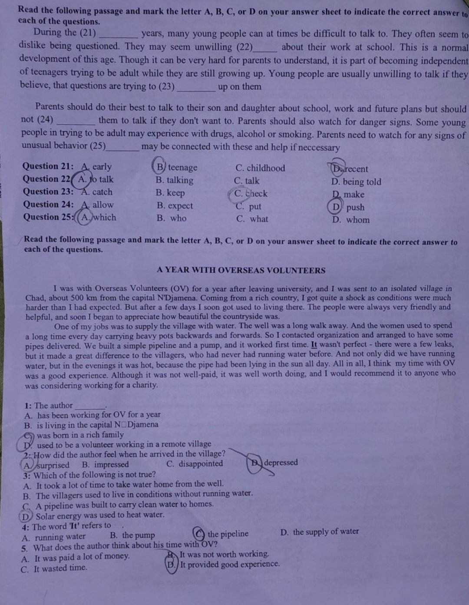
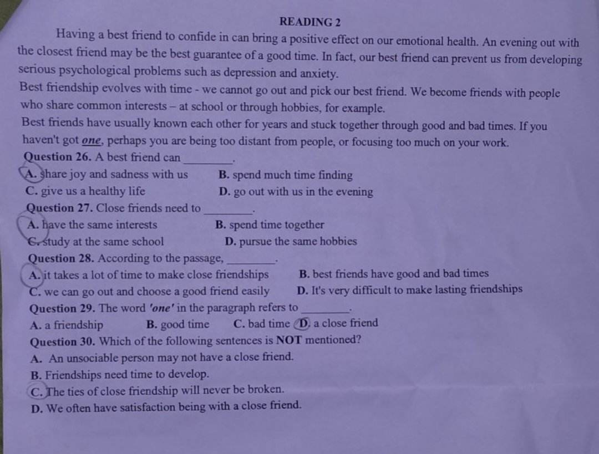

## FULL

## Reading

## Writing

### 1

My name is MInh. I have a friend near my house. His name is Hoàng. We have played together since childhood. Every day we go to school together and go home together. Since my house and Hoàng are close together, we always go wherever we go. Hoang is a funny person. We often play soccer and badminton together. Hoang is better than me. He often instructs me to solve the homework. Hoang is a good student so my parents really like him. Every time I ask permission to go out with Hoang my parents, I happily agree. Hoang is very hard-working, in his free time he often helps his mother clean the house and cook rice. I am very proud to have a friend like Hoàng.

I’m going to talk about my mom, who I think is the most wonderful person I’ve ever known. Currently, I’m living away from home since I’m going to college in a different city, but I still talk to her every day. She’s my source of inspiration and wisdom.

### 2

My mom is a great person. Not only is she smart and resilient but she’s also generous to other people around her. She was born in an impoverished family as my grandparents didn’t have much. She’s always told me that her only escape was education.

However, the first time she took the university exam, she failed due to the insurmountable pressure on her shoulder being the only hope of the family. My grandparents didn’t have more money to support her the following year, so for months, she hand reared a litter of piglets to make money. The year after that, with more experience, she aced the test, got to the university, and became a pharmacist 5 years after.

These days, she’s also a successful businesswoman with her own pharmacy. She told me the reason why she became a pharmacist was that she could take care of my grandparents. Nevertheless, she’s helped many more people in need. She donates her time and money to charitable organisations.

As a mother, she always teaches me to be fair and honest. I truly believe these characteristics have helped me a lot in life. And she’s the first person who comes to me whenever I feel unhappy.

These are the reasons why I admire my mom.

### 3

I am going to talk about MONO. He is a new famous singer and songwriter. Recently she has released her first album, “22”. This album is successful nationally and I really love it. 

I have known MONO since he debut song, “Quen Anh Di”. It came out over a few months ago. At that time, I thought his album not so good, but I was impressed with he voice and her performance when full album released. I guessed this man would become one of the most well-known artists in the future. Now I know I was so right.

To be honest, I did not listen to her very often in the past. I just started to listen more these days. Although he is called Son Tung's younger brother, he is not influenced too much by his brother. He has a dynamic, youthful energy when performing. That is even more evident through the performance at Miss grand Vietnam. He will be a potential in the future.
