## Câu 1: Hãy phân biệt cơ chế hấp thụ nước với cơ chế hấp thụ ion khoảng ở rễ cây.
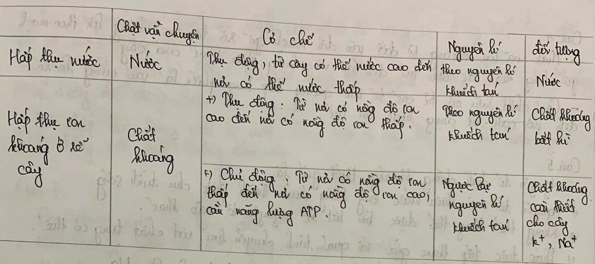
## Câu 2: Cho biết có bao nhiều con đường hấp thụ nước từ đất vào mạch gỗ? Mô tả mỗi con dương. Hãy nêu và vai trò của vòng đai Caspari?
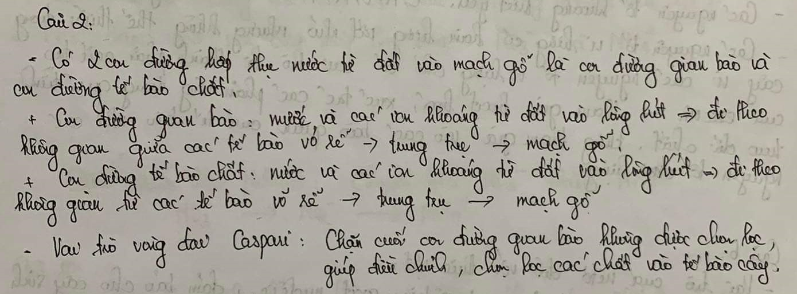
## Câu 3: Vì sao dưới bóng cây mắt hơn dưới mãi cho ở vật liệu xây dựng”

• Tác nhân chủ yêu nào điều tiết độ mở của khi không ?

• Nêu ý nghĩa của quá trình thoát hơi nước ở là

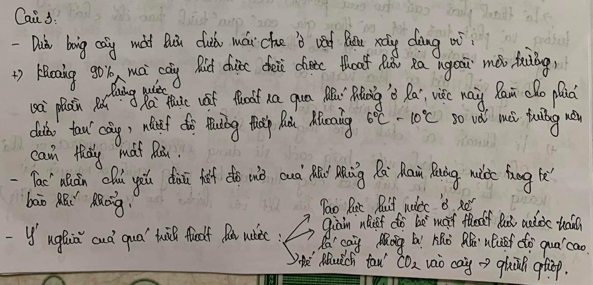
## Câu 4: Hãy mô tả con đường vận chuyển nước, chất khoáng hòa tan và chất hữu cơ trong cây?
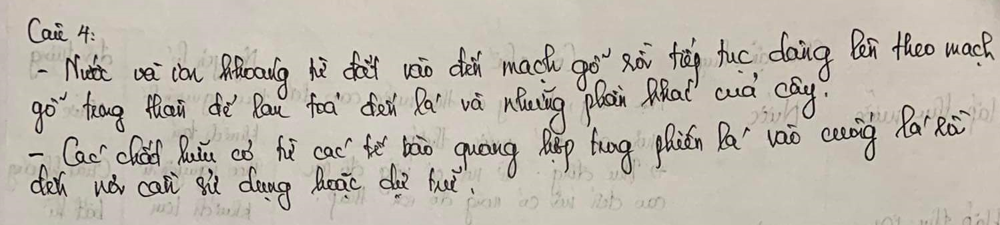
## Câu 5: Nguyên tố dinh dưỡng khoảng thiết yếu là gì? Có mấy nhóm nguyên tố khoáng thiết yếu, lấy ví dụ: 
Tại sao các nguyên tố vi lượng chỉ cần 1 lượng rất nhỏ nhưng không thể thiếu đối với sự sinh trưởng- phát triển của thực vật
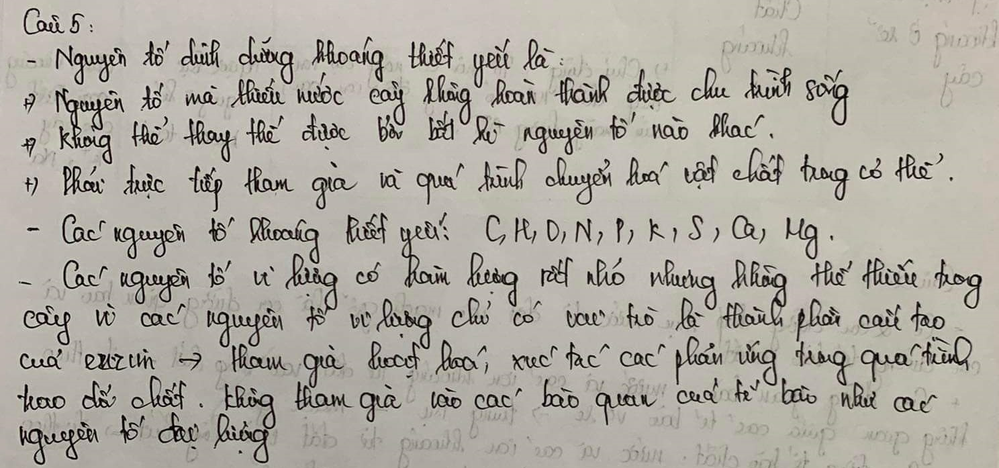
## Câu 6: Nitơ có vai trò gì đối với thực vật? Những sinh vật nào có khả năng cố định nitơ? chúng cố định bằng cách nào?

## Câu 7: Nếu các dạng nitơ có trong đất và các dạng như mà cây hấp thụ được. 
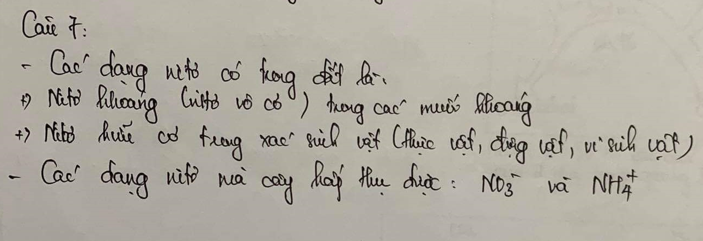
## Câu 8: Rễ cây hấp thụ nitơ ở dạng NH. (dạng khử) và NO, (dạng ở xi hóa) từ đất, nhưng nitơ trong các hợp chất hữu cơ câu thành cơ thể thực vật chỉ tồn tại ở dạng khử. Từ đó, hãy giả thiết phải có quá trình gì xảy ra trong cây

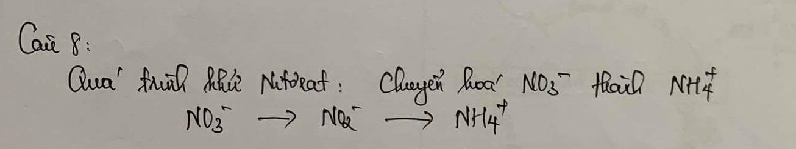
## Câu 9: Trinh bày vai trò của quá trinh cổ định nitơ phân tử bằng con đường sinh học đối với sự dinh dưỡng của thực vật.

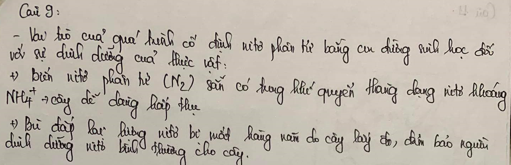
## Câu 10: Quang hợp ở thực vật là gì ? Viết phương trình quang hợp tổng quát. Vì sao quang hợp có vai trò quyết định đối với sự sống trên Trái Đất "
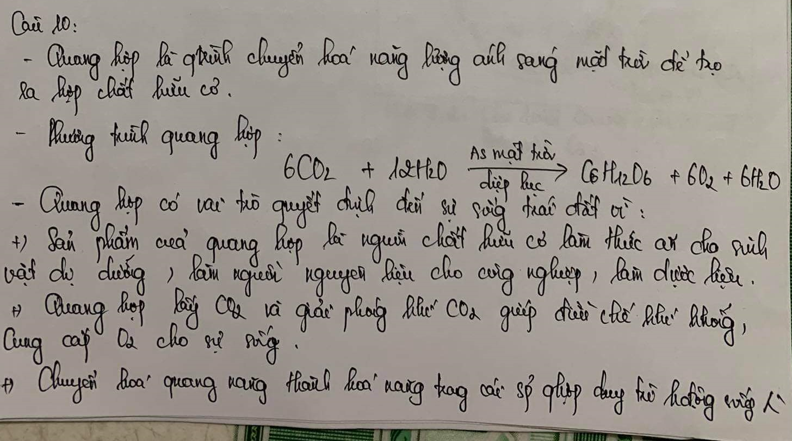
## Câu 11

## Câu 12: Quan sát hình 9.1 và 9.1 SGK

1. Hãy chỉ rõ điều kiện, nguyên liệu của pha sáng, sản phẩm của pha sáng chuyển cho pha tôi là gì?

2. Hãy chỉ ra trên hình 9.2 các điểm mà tại đó sản phẩm của pha sáng đi vào chu trình Canvin.

3. Cho biết những điểm giống nhau và khác nhau quang hợp giữ thực vật C3 vi C4
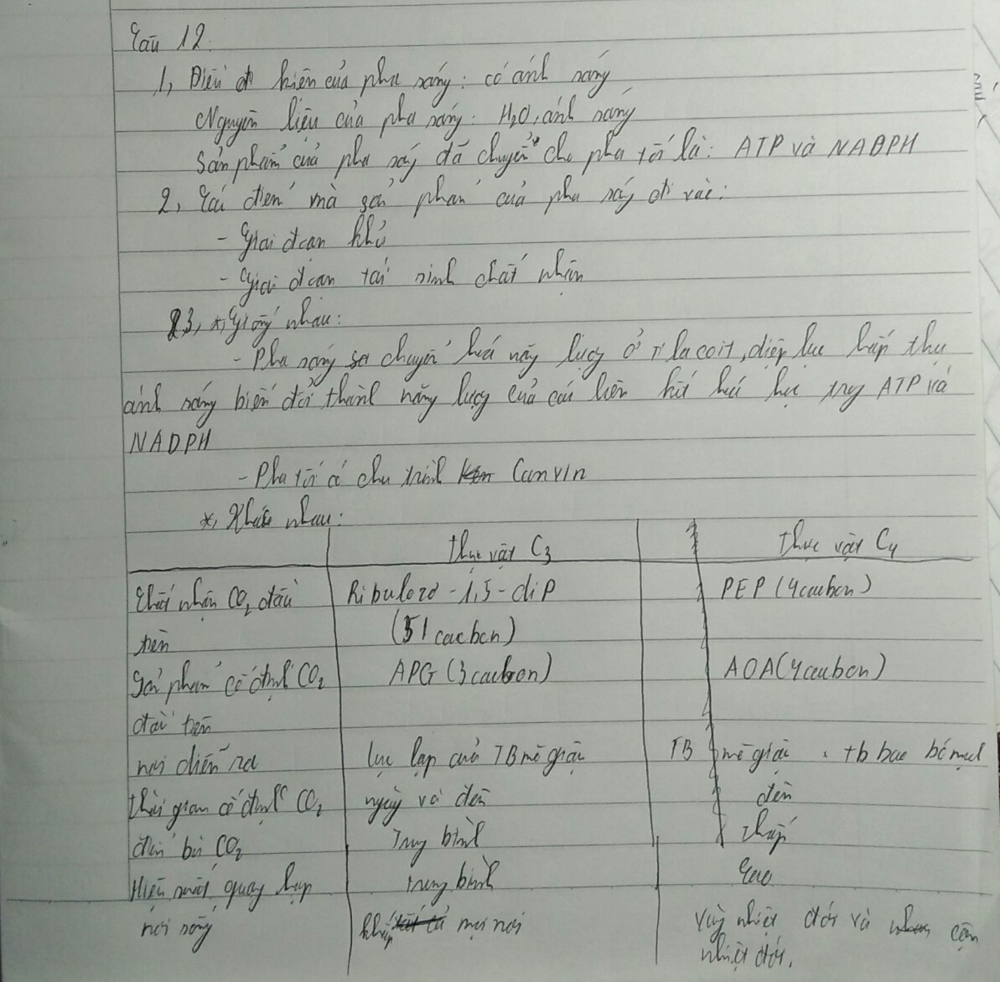
## Câu 13: Phân biệt các nhóm thực vật C3, C4 và CAM
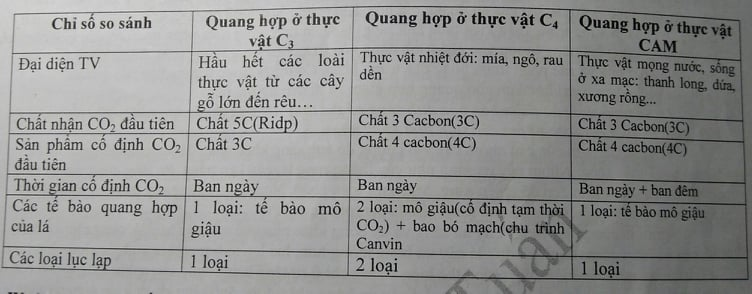